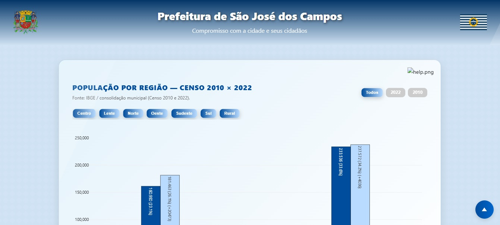
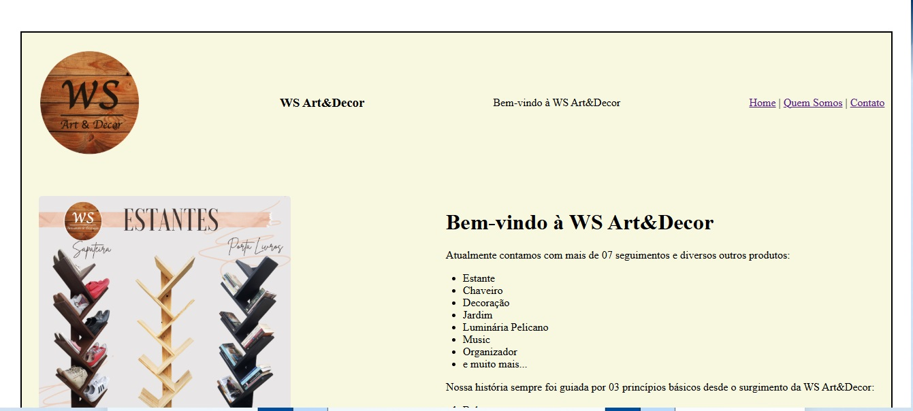

<!DOCTYPE html>
<html lang="pt-br">
  <head>
    <meta charset="UTF-8" />
    <meta name="viewport" content="width=device-width, initial-scale=1.0">

    <title>Projetos - Wagner Costa</title>

    <!-- Bootstrap CSS -->
    <link
      rel="stylesheet"
      href="https://cdn.jsdelivr.net/npm/bootstrap@4.6.2/dist/css/bootstrap.min.css"
    >

    <!-- CSS principais -->
    <link rel="stylesheet" href="static/css/base.css">
    <link rel="stylesheet" href="static/css/header.css">
    <link rel="stylesheet" href="static/css/content.css">
    <link rel="stylesheet" href="static/css/footer.css">
    <link rel="stylesheet" href="static/css/projetos.css">

    <!-- Bootstrap JS -->
    
    
    
  </head>
  <body>
    <!-- HEADER -->
    <header class="hero">
      

        <h1>Wagner Costa</h1>
      

      <nav class="navbar navbar-expand-md bg-dark navbar-dark">
        <button class="navbar-toggler" type="button" data-toggle="collapse" data-target="#collapsibleNavbar">
          
        </button>
        

          <ul class="navbar-nav">
            <li class="nav-item"><a class="nav-link" href="index.html">Sobre</a></li>
            <li class="nav-item"><a class="nav-link" href="projetos.html">Projetos</a></li>
            <li class="nav-item"><a class="nav-link" href="expertise.html">Expertise</a></li>
            <li class="nav-item"><a class="nav-link" href="eventos.html">Eventos</a></li>
            <li class="nav-item"><a class="nav-link" href="cv.html">C.V.</a></li>
            <li class="nav-item"><a class="nav-link" href="contato.html">Contato</a></li>
          </ul>
        
  
      </nav>
    </header>

    <!-- CONTEÚDO -->
    <section class="content">
      <header>
        <h2>Projetos</h2>
      </header>

      

        

          <!-- COLUNA API -->
          

            
API

            
Aprendizagem por Projetos Integrados

            
Metodologia implementada pela FATEC como parte de seu modelo de ensino, promovendo a integração entre faculdade e empresas na resolução de desafios reais do mercado. Baseada em licenças de código aberto (OSI/AFL-3.0), a metodologia proporciona aos alunos experiência prática em um ambiente de desenvolvimento semelhante ao encontrado no mercado profissional.

            

              

                
                

                  
JanoSys SIGNA

                  <h3>Sistema Integrado de Gestão de Normas Aeronáuticas</h3>
                  
Plataforma web para centralizar requisitos normativos com filtragem avançada e controle de acesso multinível.

                  

                    2º sem · DSM
                    DevTeam · FrontEnd
                  

                

              

              

                
                

                  
JanoSys

                  <h3>Visualização de Dados do Censo 2010/2022</h3>
                  
Dashboard para visualização e análise de dados demográficos do município, com subsídios para alocação de recursos públicos.

                  

                    1º sem · DSM
                    Product Owner
                  

                

              

            

          

          <!-- COLUNA ACADÊMICO -->
          

            
Acadêmico

            
Projetos desenvolvidos no contexto das disciplinas do curso de DSM · Desenvolvimento de Software Multiplataforma · FATEC, evidenciando a aplicação dos conhecimentos adquiridos e a evolução técnica ao longo da graduação.

            

              

                
                

                  
Aerocode

                  <h3>Sistema de Gestão de Produção de Aeronaves</h3>
                  
MVP em linha de comando (CLI) simulando o processo completo de produção aeronáutica, do cadastro à entrega.

                  

                    2º sem · DSM
                  

                

              

              

                
                

                  
Portfólio

                  <h3>Site Portfólio Pessoal</h3>
                  
Desenvolvimento web pessoal com foco em HTML, CSS e boas práticas de desenvolvimento front-end.

                  

                    1º sem · DSM
                  

                

              

            

          

        

        <!-- Modal -->
        

          

            <button class="modal-proj-close" onclick="fecharModal()">✕</button>
            
            <h2 id="modalTitulo"></h2>
            <h4 id="modalSubtitulo" class="modal-subtitulo"></h4>
            

            

            

            <a id="modalLink" href="#" target="_blank" class="modal-btn">Ver projeto ↗</a>
          

        

      

      

        

          

            
            

              <h3>Projeto Acadêmico</h3>
              
P.

              2º sem · DSM
              Full Stack
            

          

          

            
            

              <h3>Aprendizagem por Projetos Integrados</h3>
              
Plataforma web para gestão normativa com filtros avançados e controle de acesso multinível.

              2º sem · DSM
              DevTeam · FrontEnd
            

          

          

            
            

              <h3>Projeto Acadêmico · CLI</h3>
              
Sistema em Linha de Comando simulando um processo de produção.

              2º sem · DSM
            

          

          

            
            

              <h3>Aprendizagem por Projetos Integrados</h3>
              
Dashboard para visualização dos dados do CENSO 2010/2022.

              1º sem · DSM
              Product Owner
            

          

          

            
            

              <h3>Projeto Acadêmico · Site Particular</h3>
              
Projeto introdutório de desenvolvimento web com foco em UX e design digital.

              1º sem · DSM
            

          

        

        <!-- Modal -->
        

          

            <button class="modal-proj-close" onclick="fecharModal()">✕</button>
            
            <h2 id="modalTitulo"></h2>
            <h4 id="modalSubtitulo" class="modal-subtitulo"></h4>
            

            

            

            <a id="modalLink" href="#" target="_blank" class="modal-btn">Ver projeto ↗</a>
          

        

      

    </section>

    <!-- FOOTER -->
    <footer class="footer">
      

        
        
        
      

      

        <h3>WGCosta</h3>
        
Aprendendo. Construindo. Evoluindo.

        
&copy;  - Todos os direitos reservados.

      

    </footer>

    

    <!-- MARCAR A PÁGINA ATUAL -->
      

      

      

  </body>
</html>